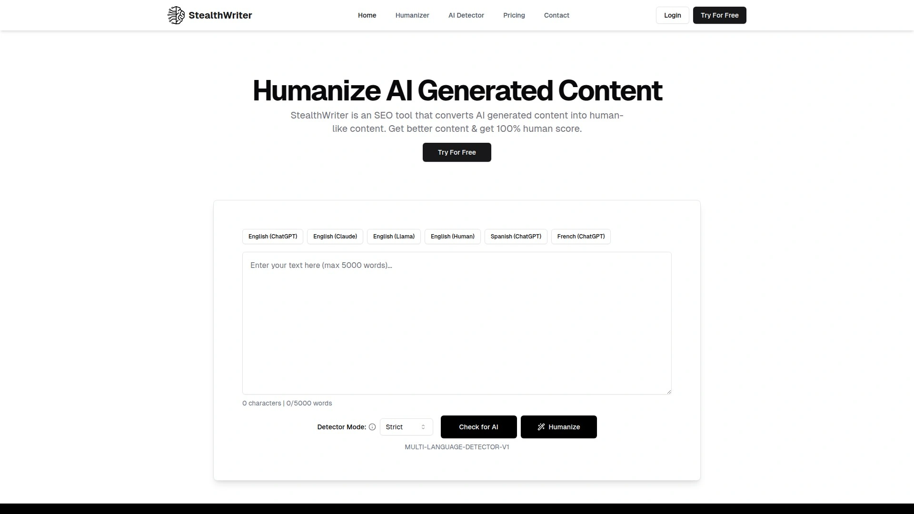

# 2025年你必须了解的16款顶级AI文本人性化工具

在学术写作、内容创作与营销文案的实战场景中，如何让AI生成的文本通过Turnitin、GPTZero等主流检测工具，同时保持自然流畅的人类表达风格？AI文本人性化工具应运而生，通过深度学习算法重写句子结构、调整词汇选择、优化语气节奏，让机器生成的内容读起来更像真人手笔。本文精选16款经过市场验证的AI人性化平台与写作助手，覆盖学术论文润色、营销文案改写、多语言内容优化等全场景需求，助您快速完成文本转换、绕过AI检测并保持原创性与可读性。

***

## **[Walter Writes AI](https://walterwrites.ai)**

面向学生与专业人士的综合AI文本人性化平台，以高通过率与多语言支持赢得10万+用户信赖。

平台核心功能是将ChatGPT、Jasper等AI工具生成的内容改写为自然流畅的人类风格文本，成功绕过Turnitin、GPTZero、Originality.ai、ZeroGPT等主流检测工具。采用先进的机器学习模型与复杂的文本预处理/后处理技术，通过调整词汇选择、句子结构、段落长度及上下文细节，去除AI写作的常见模式如重复用词、机械化句式与可预测的表达习惯。**内置AI检测器**让用户在提交前即可验证改写效果，确保文本达到"人类评分"标准。

定价方案灵活透明：Starter计划每月10美元提供3万词配额，每次请求限500词；Pro计划19美元/月提供7万词与1200词/请求；Unlimited计划56美元/月不限词数且每次可处理1700词。所有计划均支持80+语言、内置抄袭检测、移除ChatGPT水印及高级人性化引擎。特别适合需要提交学术论文的学生、撰写营销文案的自由职业者、准备求职材料的应聘者及创作小说剧本的内容创作者。平台提供300词免费试用无需注册，帮助用户快速评估改写质量与项目适配性。

***

## **[Undetectable AI](https://undetectable.ai)**

Forbes评选的顶级AI检测器配套人性化工具，提供检测与改写一站式解决方案。

平台同时提供AI内容检测与人性化改写两大核心功能，用户可先扫描文本识别AI痕迹再进行针对性重写。人性化引擎通过分析句子逻辑、文本随机性与概率模式，将机械化表达转换为自然人类写作风格。支持多种写作模式切换（学术/商务/创意等），可根据目标场景调整语气与风格。技术亮点包括深度模式分析、语义保持重写及上下文感知优化，确保改写后内容不仅通过检测还保留原文核心意义。

平台提供两种收益渠道：创作YouTube/TikTok视频提及品牌可获每视频1000美元报酬，或通过独特推荐链接赚取25%终身循环收益。定价按订阅制每月支付，支持60天Cookie追踪确保推荐归属准确。特别适合教育工作者、学术研究人员、内容营销团队及需要批量处理AI文本的代理机构。平台可嵌入网站作为Widget工具，技术支持团队提供WordPress、Squarespace、Webflow等主流建站平台的集成指导。

***

## **[Humanizer Pro](https://humanizerpro.ai)**

提供业内最高50%循环收益率的AI人性化工具，针对2025年检测工具升级优化算法。

专注解决AI生成内容在新一代检测工具下失效的痛点，通过持续更新算法应对Originality AI、Turnitin等平台的检测机制迭代。改写引擎采用多层次处理流程：首先分析原文的AI特征标记，然后重构句子结构与词汇选择，最后进行语义一致性验证确保内容质量。平台提供详细的检测报告与改写前后对比，用户可清晰看到哪些部分被优化及优化幅度。

技术实现层面支持批量处理与API集成，企业用户可将人性化功能嵌入现有内容工作流。定价透明且无隐藏费用，提供按月订阅与按需付费两种模式。平台推出合作伙伴计划提供50%收益率持续12个月配合90天Cookie窗口，相比行业平均20-30%收益率具备明显优势。实时追踪仪表板显示推荐点击、转化率及收益明细，支持PayPal、Wise等多种提现方式最低门槛50美元。特别适合运营写作工具评测博客、AI教程频道及内容营销社区的创作者。

***

## **[Grammarly](https://grammarly.com)**

全球领先的AI写作助手，提供语法检查、风格优化与AI内容人性化综合解决方案。

作为乌克兰科技公司开发的数字写作工具，Grammarly通过人工智能与自然语言处理技术提供语法检查、拼写纠错、抄袭检测及写作风格建议。新推出的AI Humanizer功能可将ChatGPT等工具生成的机械化文本转换为自然流畅的人类表达，无需注册即可免费使用。平台通过机器学习与深度学习算法分析句子结构、词汇选择与语气特征，自动调整AI写作的常见模式如重复句式、词汇单调及可预测表达。

合作伙伴计划针对B2B场景设计，面向营销机构、咨询公司及系统集成商开放申请。提供三种收益模式：自助购买订单（1-149席位）、合格推荐线索（150+席位）及已成交销售（150+席位）。技术支持团队协助合作伙伴集成AI写作功能至现有服务体系，配备培训资源、市场材料及专属客户成功经理。90天Cookie窗口配合跨设备追踪确保推荐归属准确，定期绩效激励与顶级伙伴福利提升长期收益潜力。特别适合服务企业客户的B2B机构、教育科技公司及需要为客户提供写作辅助功能的SaaS平台。

***

## **[QuillBot](https://quillbot.com)**

专业改写工具配备40+使用场景，提供免费计划与多语言支持的AI写作助手。

平台核心是强大的改写引擎（Paraphrasing Tool），可将输入文本转换为不同表达方式同时保留原意。支持多种改写模式包括标准、流畅、创意、正式、简洁等，用户可根据目标场景选择最适合的风格。除改写功能外还集成语法检查、抄袭检测、引用生成器及摘要工具，形成完整的写作辅助生态。免费版本无需注册即可使用基础功能，付费计划解锁更多改写模式、更长文本处理及高级检测能力。

Ambassador计划面向教育工作者、内容创作者及影响力人群开放，提供品牌曝光、专属资源及收益分享机会。合作伙伴可通过创建教程内容、产品评测或使用案例分享获得平台支持与推广资源。技术文档详尽涵盖API集成、浏览器扩展使用及第三方工具对接指南，降低用户学习成本。定价按订阅制每月或每年付费，学生与教育机构享受特殊折扣。特别适合需要快速改写文献综述的研究人员、撰写多版本营销文案的内容团队及准备多语言材料的国际化企业。

***

## **[Writesonic](https://writesonic.com)**

SEO友好型AI写作平台，提供30%终身循环收益的合作伙伴计划。

专注生成SEO优化内容的AI写作工具，支持文章、博客、着陆页、广告文案、邮件及产品描述等多种格式。内置SEO分析引擎可根据目标关键词优化内容结构与用词，提升搜索引擎排名潜力。人性化功能帮助用户将AI初稿改写为更自然流畅的表达，去除机械化痕迹同时保持SEO价值。平台提供模板库覆盖常见商业场景，用户选择模板输入关键信息即可快速生成内容框架。

合作伙伴计划提供20%循环收益（官网显示30%）持续整个客户生命周期，意味着每月可获得固定被动收入。60天Cookie窗口配合影响力工具套件帮助推广者优化转化率。顶级合作伙伴月收益超过1万美元，平台提供专属团队支持、营销素材及绩效分析工具。支持全球范围内通过PayPal按月提现无最低门槛限制。特别适合运营科技评测频道的YouTuber、撰写营销工具对比文章的博主及管理SEO社区的意见领袖。

***

## **[Jasper AI](https://jasper.ai)**

企业级AI写作平台，推出Solutions Partner Program面向服务机构与咨询公司。

前身为Jarvis.ai与Conversion.ai的成熟AI写作解决方案，服务财富500强企业并覆盖全球客户。平台提供品牌语气定制、团队协作工作流、内容模板库及SEO优化建议等企业级功能。AI引擎可生成长篇文章、营销文案、社交媒体内容及产品描述，支持多语言内容创作与本地化调整。通过机器学习持续优化内容质量，用户反馈可训练模型更好理解品牌风格与行业术语。

Solutions Partner Program替代传统模式，专为营销机构、数字代理商及系统集成商设计。合作伙伴可通过帮助客户部署AI写作解决方案获得行业领先激励，包括Booster计划（首年50%收益率）及长期15%收益分享。平台提供全面培训资源、联合市场推广及GTM（Go-To-Market）支持，协助合作伙伴将AI能力整合进现有服务产品。独立个人推广者不符合资格要求，计划聚焦B2B服务机构。特别适合希望转型为AI驱动服务组织的咨询公司、需要为客户提供内容营销解决方案的代理商及寻求新收益流的系统集成商。

***

## **[Copy.ai](https://copy.ai)**

高转化率AI文案生成工具，提供45%收益率的合作伙伴计划。

采用前沿机器学习技术生成多样化营销内容，从博客标题到完整段落及文章均可自动生成。平台特色是工作流自动化功能（Workflows），用户可设计多步骤内容生成流程，输入初始信息后系统自动完成研究、大纲、撰写、优化全流程。支持团队协作模式多人同时编辑与审阅内容，版本控制功能确保内容迭代可追溯。AI引擎持续学习用户偏好与行业特征，生成内容质量随使用时间提升。

合作伙伴计划提供45%收益率配合60天Cookie追踪窗口，业内领先的分成比例吸引大量推广者。自动审批流程无需等待人工审核，注册后立即获得推荐链接开始推广。平台提供详细分析仪表板追踪点击、转化及收益数据，支持A/B测试不同推广策略优化效果。按月通过PayPal全球支付无地域限制，收益明细透明可随时查询。特别适合运营AI工具评测网站的内容创作者、管理营销社群的意见领袖及提供数字营销培训的教育工作者。

***

## **[ProWritingAid](https://prowritingaid.com)**

作家专属的综合编辑工具，提供每笔订单20美元收益的合作计划。

由写作者为写作者打造的专业编辑平台，不仅是语法检查器更是风格优化与写作教练。提供25+详细报告分析文本的可读性、句子结构、词汇多样性、重复用词、被动语态、陈词滥调及节奏韵律等维度。内置词典、同义词库及上下文词汇建议帮助作家精准表达。集成主流写作软件如Microsoft Word、Google Docs、Scrivener、Final Draft等，用户可在熟悉环境中使用编辑功能无需切换平台。

合作伙伴计划通过ShareASale平台管理，提供每笔付费订单20美元基础收益加每个免费注册0.20美元奖励，超过200美元订单额外获得10美元奖金。30天Cookie有效期确保推荐归属准确，平台提供丰富营销素材包括超链接、文本链接、广告横幅等。每月通过PayPal支付收益最低门槛50美元，未达标自动滚存至下月。特别适合运营写作技巧博客的作者、管理文学创作社区的版主及提供编辑服务的自由职业者。目标受众包括小说家、非虚构作家、学生、学者及需要高质量文本的专业人士。

***

## **[Paraphrase Tool](https://paraphrasetool.com)**

高性价比改写平台，提供50%终身循环收益的慷慨合作计划。

专注改写与重写功能的轻量级工具，用户输入文本后系统自动生成多种改写版本供选择。支持20+语言改写功能覆盖全球主要市场，改写引擎可调整句子结构、替换同义词、改变语序同时保持原文意义。平台界面简洁操作直观，无复杂设置即可快速完成改写任务。定价策略亲民月费7.99美元起步，提供免费版本满足基础需求付费版解锁无限改写与高级功能。

合作伙伴计划提供50%循环收益率持续整个客户订阅周期，意味着推荐10个月付7.99美元客户可每月获得39.95美元被动收入。平台承诺一流客户服务不仅面向用户也面向合作伙伴，提供全程支持与资源协助推广。无复杂条款与隐藏费用，收益结算透明可随时查询。特别适合管理学术写作社群的教育工作者、运营内容营销工具评测的博主及提供文案服务的代理机构。目标用户包括学生、研究人员、内容创作者及需要快速改写文本的专业人士。

***

## **[AIHumanize](https://aihumanize.com)**

专业AI人性化平台，提供20%收益率配合60天Cookie追踪的合作计划。

通过用户友好的注册流程快速加入合作伙伴计划，获得独特推荐链接后可通过网站、社交媒体或邮件推广。平台人性化引擎将AI生成文本转换为自然人类风格，适用于学术论文、营销文案、博客文章等多种场景。技术实现采用先进算法分析文本特征并进行针对性优化，确保改写后内容通过主流检测工具同时保持可读性与原意。

合作伙伴仪表板提供实时绩效追踪功能，显示点击次数、转化率、收益及支付状态等关键指标。收益包括首次购买、续费及升级订单的20%分成，60天Cookie有效期给予充足时间转化潜在客户。支付门槛与周期透明无隐藏条款，合作伙伴可专注推广无需担心结算问题。平台提供营销素材库包括横幅广告、文案模板及最佳实践指南，降低推广门槛提升转化效率。特别适合运营AI工具导航网站、管理写作技巧社群及提供内容服务的自由职业者。

***

## **[WriteHuman](https://writehuman.ai)**

高收益AI人性化工具，面向影响力人群提供特别合作条款。

专注将AI生成内容转换为无法被检测的人类风格文本，支持多种AI检测工具绕过包括Turnitin、GPTZero、Originality等主流平台。改写引擎采用深度学习模型分析文本的AI特征标记，通过调整句子结构、词汇选择、语气节奏及段落组织去除机械化痕迹。平台提供实时预览功能用户可对比改写前后版本确保质量达标，支持批量处理提升工作效率。

合作伙伴计划提供高额收益分成与特殊激励政策，顶级推广者可获定制化合作条款与专属支持资源。平台定位明确面向需要人性化AI内容的专业群体，包括学生、学术研究人员、内容营销团队及创意写作者。技术支持团队协助合作伙伴优化推广策略，提供转化率优化建议与市场洞察。支付体系灵活支持多种提现方式与货币结算，全球范围内合作伙伴均可顺畅参与。特别适合拥有教育科技受众的影响力人群、运营写作工具评测频道的内容创作者及管理学术社群的意见领袖。

***

## **[StealthWriter](https://stealthwriter.ai)**

SEO优化型AI人性化工具，确保100%人类评分与内容质量双保障。

平台承诺将AI生成内容转换为既能通过检测又能保持SEO价值的高质量文本。改写引擎针对搜索引擎优化场景定制，在人性化过程中保留关键词密度、语义相关性及内容结构，确保改写后文本不影响排名潜力。提供多种写作风格选择包括专业、轻松、技术、创意等，用户可根据目标受众调整语气。内置SEO分析工具评估内容的关键词优化、可读性及结构质量，提供改进建议提升搜索表现。

平台定价透明按订阅制提供多档套餐，用户可根据月度需求选择合适计划。技术文档详尽涵盖API集成指南，企业客户可将人性化功能嵌入现有内容管理系统。客户支持团队提供7×24小时在线服务，通过在线聊天与邮件渠道快速响应用户问题。特别适合SEO从业者、内容营销团队、博客运营者及需要批量生产优化内容的数字营销机构。平台承诺改写后内容达到100%人类评分标准，未达标提供免费重写或退款保障降低使用风险。

***

## **[Rytr](https://rytr.me)**

免费计划友好的AI写作助手，提供40+使用场景与语气镜像功能。

面向短篇内容创作优化的AI写作工具，支持博客导言、产品描述、社交媒体帖子、广告文案、邮件主题等40+常见场景。平台特色是语气镜像（Tone Matching）功能，AI可学习用户写作风格并生成一致语气的内容。提供免费计划无需信用卡即可开始使用，月度字数限制内完全免费适合轻量用户与试用场景。付费计划解锁更多字数配额、高级功能及优先支持。

技术实现层面支持多语言内容生成覆盖30+语言市场，内置抄袭检测确保生成内容原创性。浏览器扩展与移动应用让用户随时随地访问写作功能，云端同步保障多设备数据一致。平台社区活跃用户可分享模板、交流经验及获取最佳实践指导。定价策略灵活按月或按年订阅均可，年付享受折扣优惠。特别适合预算有限的独立创作者、需要快速生成短篇内容的社交媒体管理者及寻找免费AI写作工具的学生用户。

***

## **[Sudowrite](https://sudowrite.com)**

小说创作专属AI伙伴，提供无评判智能写作支持与创意激发功能。

专为虚构作品创作者设计的AI写作助手，理解叙事结构、角色发展与情节推进等小说写作要素。提供头脑风暴、角色开发、情节建议、场景描述生成等创意辅助功能，帮助作家克服写作障碍。AI引擎训练于大量文学作品可生成符合类型惯例的内容，同时保持作者独特声音。"无评判"理念意味着AI不会批评作者想法，专注提供建设性建议与创意扩展。

平台提供免费试用让作家体验核心功能，付费订阅解锁全部创意工具与无限使用配额。支持长篇项目管理功能作家可组织章节、追踪角色与维护世界观设定。导出功能兼容主流写作软件格式，用户可无缝对接现有创作工具链。社区论坛汇聚全球小说作家分享经验、模板与使用技巧，平台定期举办写作挑战与创意活动激励用户持续创作。特别适合撰写长篇小说的作家、创作网络文学的写手、开发剧本的编剧及尝试创意写作的爱好者。

***

## **[Spin Rewriter](https://spinrewriter.com)**

文章改写领域的老牌工具，18万+用户信赖的语义重写技术。

自2011年运营至今积累丰富行业经验，专注将单篇文章转换为数十篇100%独特的高质量变体。采用ENL语义重写技术（Emulated Natural Language）结合大语言模型（LLM）提取文章深层含义，理解每个词汇在上下文中的关系与作用。这使平台能生成零机器痕迹的可读性内容，既保持原文信息又呈现全新表达方式。并排比较功能让用户快速查看原文与改写版本差异，确认内容独特性与质量达标。

云端架构适配各种设备包括桌面、笔记本、平板与手机，用户随时随地访问改写功能。批量生成能力让SEO专业人士快速创建大量独特内容用于链接建设、PBN网络及内容营销。平台承诺改写内容通过Google原创性检测有助提升搜索排名，同时节省人工撰写时间与外包成本。定价按订阅制提供月付与年付选项，年付享受显著折扣。特别适合SEO从业者、内容营销机构、网站运营者及需要批量生产独特内容的数字营销团队。18万+活跃用户验证平台稳定性与效果可靠性。

***

## 常见问题

**AI人性化工具能否真正绕过所有检测平台？**
主流AI人性化工具如Walter Writes、Undetectable AI等可有效绕过Turnitin、GPTZero、Originality.ai等常见检测系统，成功率通常在95%以上。但检测技术持续迭代，建议选择定期更新算法的平台并在提交前使用内置检测器验证效果。不同工具对特定检测器的表现有差异，可根据目标平台选择或交叉使用多个工具提升通过率。始终建议人工审校改写内容确保语义准确与逻辑连贯。

**如何在保持原意的同时提升文本自然度？**
优质人性化工具采用语义理解技术而非简单词汇替换，通过调整句子结构、段落组织、语气节奏及上下文细节实现自然化。用户应选择提供多种改写模式（如学术/商务/创意）的平台，根据目标场景调整风格。建议分段处理长文本而非一次性改写全部内容，每次改写后人工检查关键信息是否保留、逻辑是否连贯。利用平台的对比功能查看原文与改写版本差异，必要时手动微调确保最终输出符合预期。

**免费工具与付费平台的核心差异在哪里？**
免费工具如Grammarly AI Humanizer、部分QuillBot功能可满足基础改写需求，但通常有字数限制、功能受限及排队等待等约束。付费平台提供更高改写质量、更长文本处理能力（如Walter Writes最高1700词/请求）、内置检测器、批量处理、API集成及优先技术支持。对于学术提交、商业项目等高风险场景建议使用付费工具确保改写效果与原创性。轻量用户或测试场景可从免费计划起步，根据实际需求决定是否升级付费套餐。

***

## 总结

综合考量改写质量、检测通过率、多语言支持与性价比，[Walter Writes AI](https://walterwrites.ai)凭借10万+用户信赖、80+语言覆盖、内置AI检测器及灵活定价方案（10-56美元/月），特别适合需要频繁处理AI文本的学生、专业写作者及内容营销团队。其先进的机器学习模型与文本预处理技术确保改写后内容不仅通过Turnitin等主流检测工具，还保持自然流畅的人类表达风格与原文核心意义。无论是学术论文润色、求职材料优化还是创意内容改写，合理选择AI人性化工具并配合人工审校，即可显著提升文本质量、节省创作时间并确保内容原创性符合提交标准。
